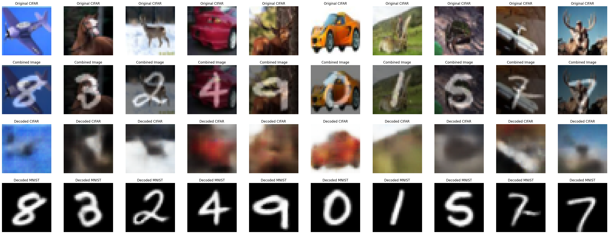

# Autoencoder Reconstruction of Mixed MNIST and CIFAR-10 Images

## 📌 Project Overview
This project explores autoencoders for reconstructing images from two distinct datasets: **MNIST** and **CIFAR-10**.  
The objective is to create an autoencoder model capable of taking the **mean of an MNIST image and a CIFAR-10 image**, feeding it into the network, and generating reconstructions of both MNIST and CIFAR-10 images.

---

## 🗂 Dataset Description
- **MNIST**: Grayscale, 1 channel, 28×28 pixels  
- **CIFAR-10**: RGB, 3 channels, 32×32 pixels  

Preprocessing:
- MNIST images are resized to 32×32 and expanded to 3 channels (RGB).  
- CIFAR-10 images are kept at 32×32 RGB.  
- A **combined dataset** is created where each sample is the mean of a MNIST image and a CIFAR-10 image.

---

## ⚙️ Methodology
1. **Combined Dataset**  
   - Randomly select an MNIST and a CIFAR-10 image.  
   - Compute the mean of the two images.  
   - Return the combined image alongside the originals.  

2. **Autoencoder Architecture**  
   - **Encoder**: Pre-trained ResNet50 backbone.  
   - **Decoders**: Two separate transposed-convolution decoders:  
     - One for CIFAR-10 reconstruction  
     - One for MNIST reconstruction  
   - **Loss Function**: Mean Squared Error (MSE).  
   - **Optimizer**: Adam with learning rate `1e-3`.

3. **Training**  
   - Batch size: 64  
   - Epochs: 30  
   - Loss = MSE(CIFAR reconstruction, original CIFAR) + MSE(MNIST reconstruction, original MNIST).  

---

## 📊 Results
- Training loss decreased from **0.0732 → 0.0171**.  
- Reconstructions show clear recovery of MNIST digits and CIFAR structures.  
- **Evaluation Metrics**:  
  - Average PSNR (CIFAR-10): **18.59 dB**  
  - Average PSNR (MNIST): **22.22 dB**  
  - → MNIST reconstructions are of higher quality compared to CIFAR-10.
 
    

### 🔹 Results Visualization

---

## 🔮 Future Work
- Try more efficient optimizers and advanced loss functions to improve reconstruction quality.  
- Experiment with other datasets and multi-modal image combinations.  
- Explore SSIM as an additional evaluation metric.  

---
